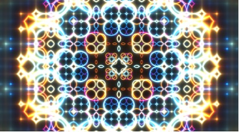
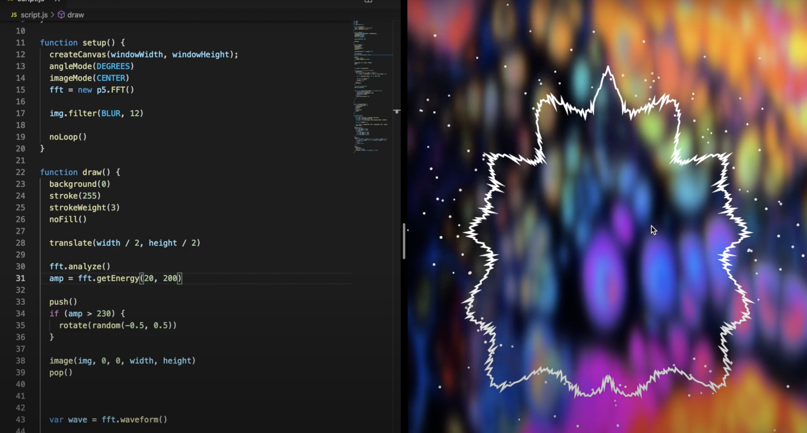

**Week8 Quiz_design research**
##### jiwu0118_9103_tut4
## Part 1: Imaging Technique Inspiration
This is an imaging technique that inspires me. Because I am very interested in the **Wheel of fortune** of Pacita Abad in the major project. This example also gives me a feeling of turning the wheel of fate. It changes different colors and shapes over time, gradually spreading from the center of the image to the surroundings. 

I think there is a lot of room for innovation in this kind of dynamic change. It's like the echo of sound traveling into a cave, which can be combined with sound to create a dynamic change related to audio.

 

>_Screenshots of [Shader Art Coding](https://www.shadertoy.com/view/mtyGWy)_

## Part 2: Coding Technique Exploration

In order to realize the dynamic effect that changes with audio, I found the coding technology of **audio visualization** on the Internet. I hope the different circles on the wheel of fortune can be like a record player. Its color and surrounding form can be changed according to the frequency and sound of music.

This code includes 5 parts: 
- Load the audio
- Waveform analysis
- Wrap the waveform in a circle
- Create the particles
- Beat detection
  

Coding Reference: https://www.youtube.com/watch?v=uk96O7N1Yo0